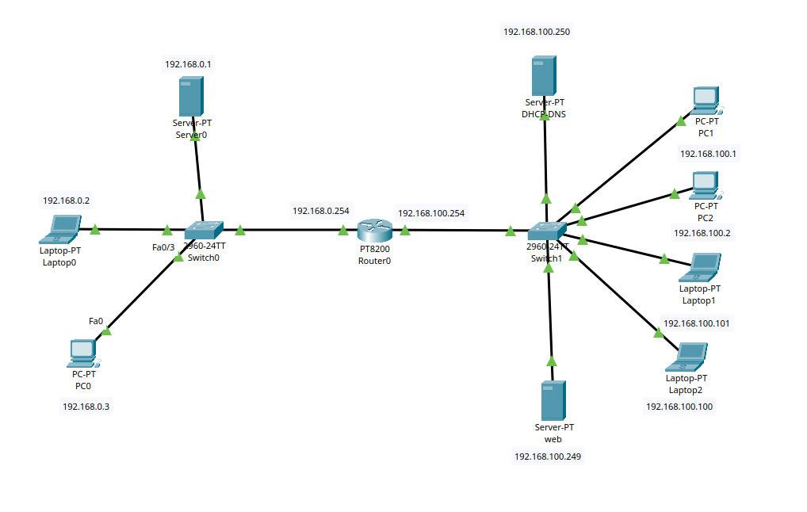
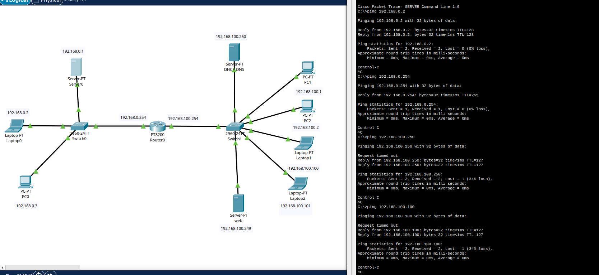

# Fondations TCP/IP — Architecture et services réseau

Lab réalisé dans le cadre de la formation "Concevez votre réseau TCP/IP" (OpenClassrooms).
Outil de simulation : Cisco Packet Tracer.

---

## Objectifs couverts

- Comprendre l'organisation physique et logique d'un réseau
- Adresser des équipements sur un réseau local et entre plusieurs réseaux
- Configurer le routage par routes connectées et les passerelles par défaut
- Déployer les services DHCP et DNS sur un serveur du réseau (DNS-DHCP)
- Appréhender le modèle OSI par la pratique

---

## Contenu du lab

**Partie 1 — Architecture physique**

Connexion de deux machines en direct puis intégration dans un réseau avec switch.
Observation du comportement des trames au niveau de la couche liaison.

**Partie 2 — Communication inter-réseaux**

Adressage IP des hôtes, configuration d'un routeur avec une interface par réseau — chaque interface reçoit une adresse IP qui sert de passerelle par défaut aux hôtes du réseau correspondant. Le routeur connaît automatiquement les réseaux directement connectés (routes connectées).
Modèle OSI appliqué à l'analyse du trafic observé.

**Partie 3 — Services réseau**

Déploiement d'un serveur DHCP : attribution automatique des adresses IP aux hôtes.
Déploiement d'un serveur DNS : résolution de noms vers adresses IP.
Vérification end-to-end par ping et requêtes DNS.

---

## Topologie



---

## Résultats

Connectivité inter-réseaux vérifiée par ping entre hôtes sur des sous-réseaux distincts.



---
## Commandes utilisées

```
# Hôtes — vérification de la configuration IP
ipconfig

# Test de connectivité entre réseaux
ping <adresse_ip>

# Routeur — assignation d'une IP sur chaque interface
# (une interface par réseau, l'IP devient la passerelle du réseau)
interface GigabitEthernet0/0
 ip address 192.168.1.1 255.255.255.0
 no shutdown

interface GigabitEthernet0/0/0
 ip address 192.168.0.254 255.255.255.0
 no shutdown

# Vérification des routes connectées
show ip route

# Vérification de l'état des interfaces
show ip interface brief
```

---

## Notions clés

- Adresse IP, masque de sous-réseau, adresse réseau, broadcast
- Passerelle par défaut — l'IP de l'interface routeur du réseau local, point de sortie vers les autres réseaux
- Routes connectées — le routeur connaît automatiquement tout réseau directement branché sur une de ses interfaces
- DHCP DORA : Discover → Offer → Request → Acknowledge
- Résolution DNS : requête A, réponse avec l'adresse IP correspondante
- Modèle OSI : correspondance couche physique / liaison / réseau / application

---

## Fichier

`reseau-tcp-ip.pkt` — topologie complète avec configuration finale
