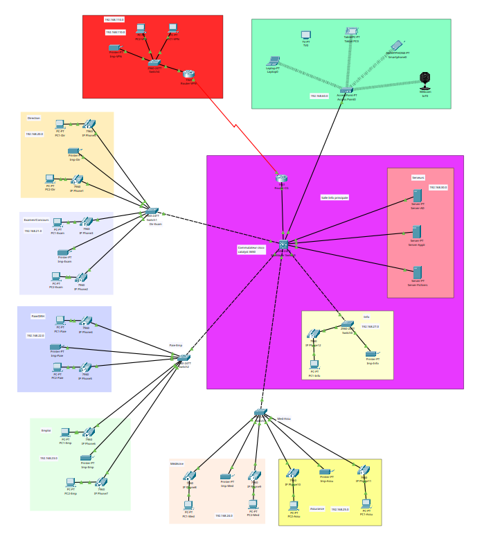
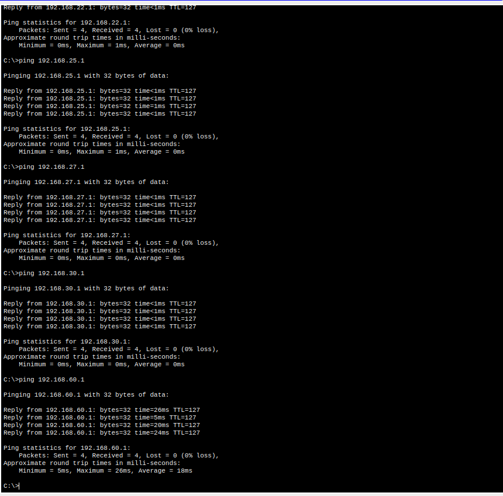
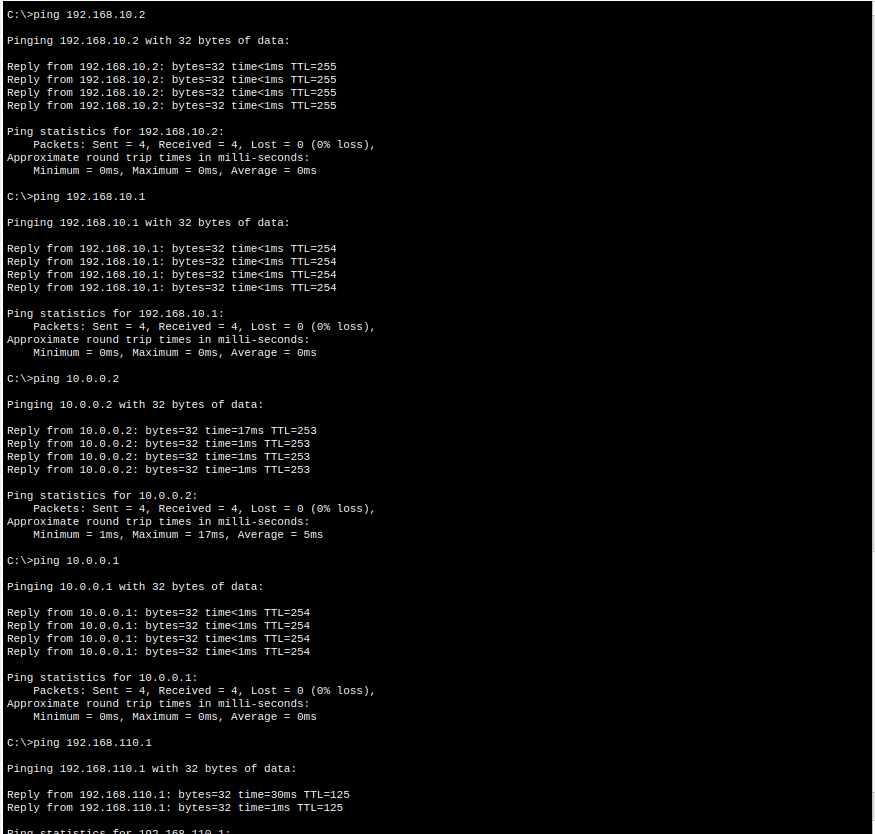

# Réseau d'entreprise multi-sites — VLANs, routage inter-VLAN et WAN

Lab réalisé dans le cadre de la formation "Simulez un réseau d'entreprise sous Cisco Packet Tracer" (OpenClassrooms).
Outil de simulation : Cisco Packet Tracer.

---

## Environnement

Cisco Packet Tracer 9.0.0

---

## Objectifs couverts

- Implémenter une infrastructure réseau d'entreprise complète
- Configurer et administrer des commutateurs Cisco via l'interface CLI
- Segmenter le réseau par VLANs et réduire les domaines de diffusion
- Mettre en place le routage inter-VLAN (Router-on-a-Stick)
- Interconnecter deux sites distants via une liaison WAN avec routes par défaut
- Intégrer un réseau sans fil avec point d'accès
- Sécuriser l'accès distant aux équipements via SSH
- Diagnostiquer et résoudre des pannes réseau

---

## Topologie



12 sous-réseaux configurés : /20, /21, /22, /23, /24, /25, /27, /30, /40, /50, /60, /100.
Deux routeurs interconnectés via une liaison WAN.
Infrastructure centrale avec trois serveurs (AD, Appli, Fichiers) et deux commutateurs Catalyst.
Zone sans fil avec point d'accès et clients mobiles.

---

## Contenu du lab

**Partie 1 — Infrastructure de base**

Câblage et adressage IP de l'ensemble des équipements terminaux.
Intégration du point d'accès sans fil et association des clients WiFi.

**Partie 2 — Administration des commutateurs**

Prise en main de l'interface CLI Cisco IOS.
Configuration de base : hostname, enable secret, bannière.
Configuration SSH pour accès distant sécurisé.
Dépannage commutateurs et WiFi.

**Partie 3 — Routeurs et liaison WAN**

Configuration des interfaces du routeur central et du routeur distant.
Liaison WAN entre les deux routeurs.
Routes par défaut sur chaque routeur pour acheminer le trafic vers le site distant.
Diagnostic et résolution de pannes routeur.

**Partie 4 — VLANs**

Création des VLANs par département.
Assignation des ports en mode access.
Configuration des liens trunk 802.1Q entre commutateurs.
Routage inter-VLAN via sous-interfaces (encapsulation dot1Q).
Sauvegarde des configurations (write memory).

---

## Commandes utilisées

```
# --- Commutateur ---

# Configuration de base
hostname RouteurCG
enable secret <password>
line vty 0 15
 transport input ssh
 login local

# Création VLAN et assignation
vlan 20
 name DIRECTION
interface FastEthernet0/1
 switchport mode access
 switchport access vlan allowed .....

# Lien trunk
interface FastEthernet0/24
 switchport mode trunk

# Vérification
show vlan brief
show interfaces trunk
show running-config

# --- Routeur central — sous-interfaces (Router-on-a-Stick) ---

interface GigabitEthernet0/0.20
 encapsulation dot1Q 20
 ip address <gateway_vlan20> 255.255.255.0

# Interface WAN
interface GigabitEthernet0/1
 ip address <ip_wan> 255.255.255.0
 no shutdown

# Route par défaut vers le site distant
ip route 0.0.0.0 0.0.0.0 <next-hop_wan>

# Vérification
show ip interface brief
show ip route
```

---

## Notions clés

- Domaine de collision vs domaine de diffusion
- VLAN — segmentation logique au niveau L2, réduction du broadcast
- Trunk 802.1Q — transport de trames multi-VLAN sur un lien unique
- Router-on-a-Stick — routage inter-VLAN sur une seule interface physique via sous-interfaces
- Route par défaut — `0.0.0.0 0.0.0.0`, achemine tout trafic sans correspondance vers le routeur distant
- SSH — remplacement de Telnet pour l'administration sécurisée à distance

---

## Résultats

Connectivité inter-VLAN vérifiée par ping entre hôtes sur des sous-réseaux distincts.
Connectivité WAN vérifiée par ping entre les deux sites distants.





---

## Fichier

`metropole-chantilly-grenade.pkt` — topologie complète avec configuration finale
